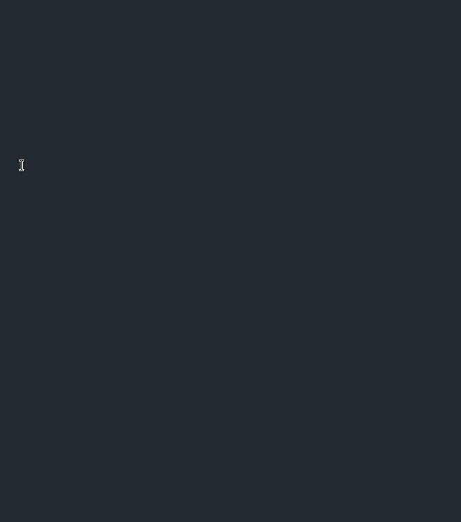
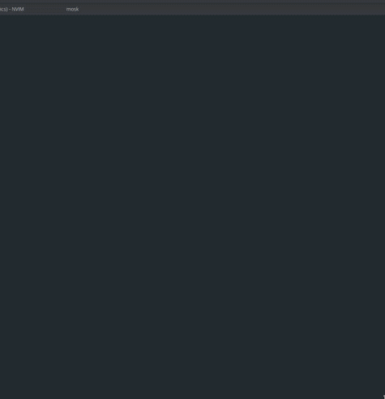
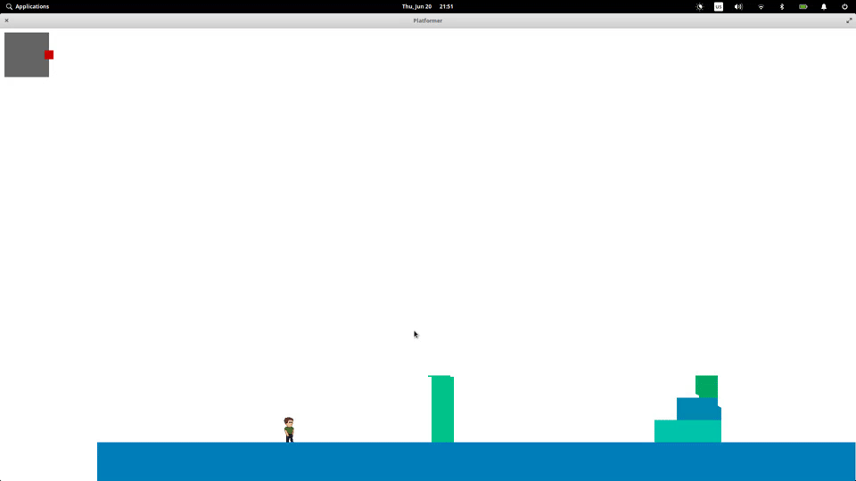

# Game mimics
I want to acquire actually useful skills and understanding of how to do things
in gamedev so I've decided to make small games and demos from scratch
starting from something trivial and plain and gradually improve it
and make it more sophisticated. Making a whole game is probably too much but
single level demo is more than enough in my opinion.

This is some kind of progress log accompanied with notes.

Demos are developed for Linux/X11 machine.
I've tried to separate platform layer from game code
so other platforms should be possible to implement without much pain (probably).

## 01 - Snake

I needed to start with something so I've chosen snake.
I needed to accomplish few techinal achievements to make a demo:

1. Show a X11 window. It was relatively easy thanks to Xlib manual published
here [https://tronche.com/](https://tronche.com/gui/x/xlib/).
1. Close a X11 window. It was harder and it looks like a hack that everybody
implements.
1. Draw some pixels inside X11 window. After watching a
[HandMadeHero](https://handmadehero.org/) - a show where Casey implements a professional game
(with main dev environment on Windows machine)
from scratch I kinda know what to expect.
Filling a buffer pixel by pixel and we are done.
1. Grab keyboard input from X11. It was really a pleasure.
1. Implement a trivial game loop (200 ms per frame :) ) and logic.

I was really satisfied with X11 API and I have not seen Wayland API
so I don't know why people are complaining so much about X11.

As a C++ programmer and because gamedev is dominated by C++ I decided to use C++
but after first demo was ready I was not really satisfied.
I knew I will implement almost everything from scratch so I decided to program
next demos in C to get rid of almost everything compiler and standard library
containers do for me.
I am not time constrained so it is not really an issue.

After demo was doing reasonably well I decided to stop and keep it simple for now.

## 02 - Arkanoid

I wanted second demo to be 60fps smooth but still trivial so I decided to make an arkanoid.
I still needed to rewrite platform code from C++ to C. I thought I knew what was C++ and what was compatible with C in my code and I was wrong :).

Few techical improvements here:

1. 60fps loop. Still way to go for a smooth image.
1. Switched to shared memory IPC for drawing a buffer. Old approach to transfer a big buffer over sockets 60 times per second was slightly inefficient.
1. Basic collision detection based on non-continuous movement. It is far from perfect.
1. Some basic vector and trigonometry stuff to know direction of collision.

Few notes on things that 100% needed improvement:

1. 60fps was not feeling smooth from time to time. I don't know exact reason (my usage of nanosleep, window manager compositor or X11). OpenGL or simillar allows to synchronize with screen so it should go away in future.
1. Non-continuous collision detection is very unstable but ok for now. More general and reliable approach should be found for next demos.

## 03 - Pacman-like

The main goal for next demo was loading and software rendering of bmp sprites
with support of alpha channel.
I wanted some CPU controlled entities also so pacman is the way to go.
I thought that these features will be most complex to create.
I was surpised that snap-to-grid movement became no. 1 in compexity for this demo but
it was fun to program and tweak.

Technical improvements in comparison with previous demos:

1. BMP sprites rendering. Alpha channel also supported.
1. Path finding in tiled environment.
1. Snap-to-grid movement for entities.
1. Record and replay input with according state restoring was added
to debug facilities. Inspired by [HandMadeHero](https://handmadehero.org/) implementation.
1. Trivial state machine logic for CPU entities.

Few notes:

1. Drawing sprites with semi-transparent pixels by hand is boring :) I was not able to make myself create other sprites for every direction of pacman and ghosts.
1. Good level design is hard :)

### Record-replay demo:

Here I press F2 to save state and start recording inputs.
I press F3 to stop recording and start replaying inputs. Inputs are looped
and state is restored at the beginning of every loop. F4 to exit loop and get control again. All current code is deterministic so it works perfectly for debugging and tweaking of behavior in combination with game code reloading using `dlopen`

## 04 - Platformer

I wanted next demo to be more dynamic and fun so I decided to make a platformer.
Gamepad support was desired also. It fits particularly well together.

Technical improvements:

1. Gamepad support in Linux using **evdev** interface (documentation can be found here [https://www.kernel.org/doc/html/latest/input/input.html]()).
1. Movement with collision detection using rays, segments and primitive subset of Minkowski algebra.
So instead of Yes/No answer for new position I get exactly how much I can move
with such speed and direction.
1. Gliding along edges of collided objects.
1. Physics of movement and jumps.
1. Camera movement code for pleasurable look and feel.
Y coordinate is fixed but X coordinate is adjusted using LERP
according to character movement.
1. Inspection of collision with ground and walls for game logic.
So you can't jump while in the air and if character is touching a wall then walljump
(sideways and up) is performed instead of regular jump.
1. Jump button buffering, so player can press jump button a little early and still
get desired jump. It was very unnatural and annoying without it.
1. Gamepad subset visualization

I don't know why but I was very proud of myself after gamepad code was implemented.
In the end it was not very
hard to implement. I believe most challenging part was to find documentation
for **evdev** interface.
Google search was filled with irrelevant information because name **evdev** collides with more popular existing python module.
I am grateful for open source tool **evtest**
which I was using for visualization and as (source code) cheatsheet to understand
how interface and device properties work.

Collision detection of two AABB rectangles was transformed into collision
of a rectangle and a point using size transformation.
I've implemented intersection of line segment and ray without assumption of alignment
to axis in hope to reuse it in future.

Jump physics constants were found empirically (live code reloading was very useful here).
It was too late when I found
that it was better to calculate them in accordance with desired time
and height of jump.

Few notes:

1. I've spent much time debugging coordinate system misallignment in rendering and
collision detection.
1. It becomes annoying to be unable to scale sprite while rendering scene.
I should implement some improvements to software rendering routines
in next demo.

